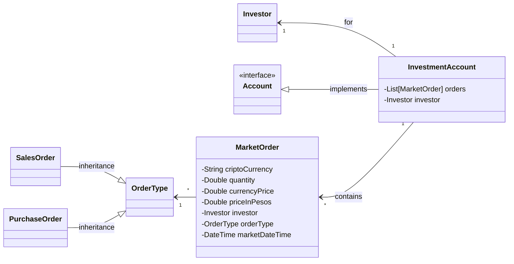

```mermaid
classDiagram
    title UML Crypto P2P Backend
    direction RL
    
    InvestmentAccount "1" --> "1" Investor : for
    
    class Investor {
    
    }
    
    class Account {
        <<interface>>
    }
    
    InvestmentAccount --|> Account : implements
    InvestmentAccount "1" --> "*" MarketOrder : contains
    
    class InvestmentAccount {
        -List[MarketOrder] orders
        -Investor investor
    }
    
    MarketOrder "*" --> "1" OrderType
    
    class MarketOrder {
        -String criptoCurrency
        -Double quantity
        -Double currencyPrice
        -Double priceInPesos
        -Investor investor
        -OrderType orderType
        -DateTime marketDateTime
    }
    
    class Account {
    
    }
    
    class OrderType {
    
    }
    
    OrderType <|-- SalesOrder : inheritance
    OrderType <|-- PurchaseOrder : inheritance
    
    class SalesOrder {
    
    }
    
    class PurchaseOrder {
    
    }
  
```